# Digital Music Recording and Storage System using Authentication and Database Encryption

## Digital Music Recording and Storage system that allows users to register, login, record, storage and rate with security techniques by authentication and encyption of data within the database.

## Introduction:

This project addresses copyright infringement concerns in the music industry, focusing on preventing unauthorised copying of user recordings. To achieve this, the application integrates advanced authentication mechanisms, role-based access control and sophisticated encryption techniques to safeguard recordings. User authentication guarantees that only registered users and administrators can access the system, with administrators having enhanced management capabilities. Another method utilised is Role-based access control. Role-Based Access Control (RBAC) is a model in which access permission for controlled content is assigned to a group who have the same role, rather than individuals (Blundo et al., 2020). For instance, this would limit regular users from viewing or managing others' recordings, while administrators maintain oversight of all recordings. 
Additionally, the encryption of filenames and passwords introduces an essential layer of security, ensuring that sensitive data remains protected even if the database is compromised. As explained by Shukla et al. (2022), this encryption process transforms filenames and passwords into unreadable formats; this makes it difficult for individuals who do not have authorisation to access the information. Therefore, in the event of a security breach, the encrypted data remains secure, which significantly enhances the overall resilience of the system against potential attacks and threats (Shukla et al., 2022).
These measures are highly effective in preventing unauthorised access and copying, thus, significantly reducing the risk of copyright infringement. Safeguarding user data and implementing access controls guarantees that recordings remain accessible exclusively to their owners and authorised personnel. The main functionalities of the application are detailed below:

## Secure Database:

The application uses encryption to protect the filenames of recordings stored in the database, ensuring that only authorised users can access and understand the data. Here is a detailed breakdown of how this encryption helps in preventing copyright infringement:

Storage of Encrypted Filenames:	
Before a recording is saved and stored in the database, its filename is encrypted. This means that in case an individual gains unauthorised access to the database, they would not be able to determine the names of the files, before they can even access the recordings themselves.

Retrieval of Encrypted Filenames:	
When a user views their recordings, the application decrypts the filenames before displaying them. This ensures that the data remains secure during storage and transit while remaining accessible in a readable format to the rightful owner.
Generation and Storage of Encryption Keys:	
A secure encryption key is generated and stored in a file when the application is first run. This key is essential for both encrypting and decrypting the filenames. The key management process ensures that the encryption is robust and that the key is not easily accessible.

Loading the Encryption Key:	
Every time the application runs, it checks for the existence of the key file. If the file exists, the key is loaded for use in encryption and decryption operations, ensuring consistency and security across sessions.

Encrypting Messages:	
The encrypt_message function uses the encryption key to securely encrypt the filenames. This makes the filenames unreadable to anyone who does not have access to the key.

Decrypting Messages:	
Conversely, the decrypt_message function decrypts the filenames when they need to be accessed by authorised users. This ensures that only legitimate users can view and manage the recordings.

## Controlled Access:
The application prevents copyright infringement through controlled access by implementing several security measures, including user authentication, role-based access control and encryption. The following steps outline how these mechanisms work together to ensure that only authorised users can access or manage recordings:

User Registration:
During registration, users create a unique username and password. The password is encrypted before being stored in the database, ensuring it remains secure.

User and Admin Roles:
The application distinguishes between regular users and the admin. Regular users can only see and manage their own recordings, while the admin has broader access for oversight. This role-based access control, combined with encrypted filenames, ensures that data is not exposed inappropriately.

User Login:
Users must provide their username and password to log in. The application decrypts the stored password and compares it with the entered password to authenticate the user.

Admin and User Roles:
The application differentiates between regular users and the admin. The admin has broader access and control over the system, while regular users can only access their own recordings.

Admin Access:
The admin can view all recordings, delete recordings, and perform other administrative tasks.

User Access:
Regular users can view and manage only their recordings. This access is restricted to ensure that users cannot view or modify other users' recordings.

Viewing Recordings:
Users can view only their recordings, ensuring that they do not have access to recordings made by other users.

Admin Management:
The admin can view and delete any recordings, providing oversight and control over the entire database.

## code decomposition
### Importing libraries:
These imports include necessary libraries for database management, audio recording, encryption, and general operations.

### Encryption Functions:
Generate Encryption Key:
This function generates a new encryption key using Fernet.

Save Encryption Key:
This function saves the generated key to a file.
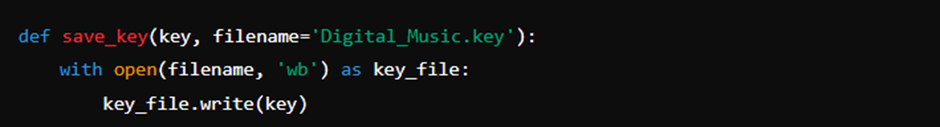

Load Encryption Key:
This function loads the encryption key from a file.
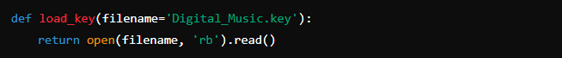

Encrypt Message:
This function encrypts a message using the given key.
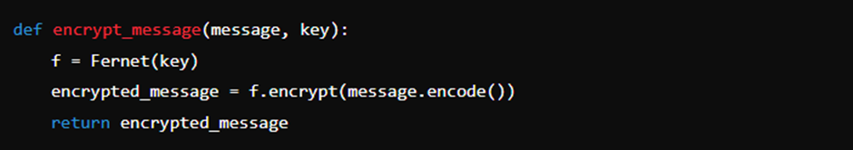

Decrypt Message:
This function decrypts an encrypted message using the given key.
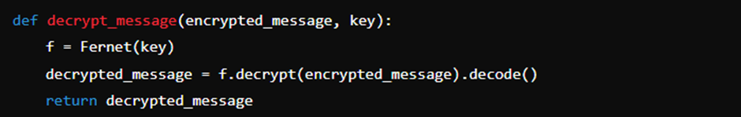

### Key Management:
Check if Key Exists:
This part checks if the encryption key file exists. If not, it generates a new key and saves it; otherwise, it loads the existing key.

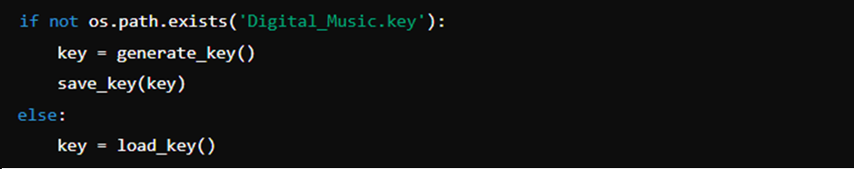

### Database Setup:
Setup Database:
This function sets up the SQLite database with users and recordings tables.

 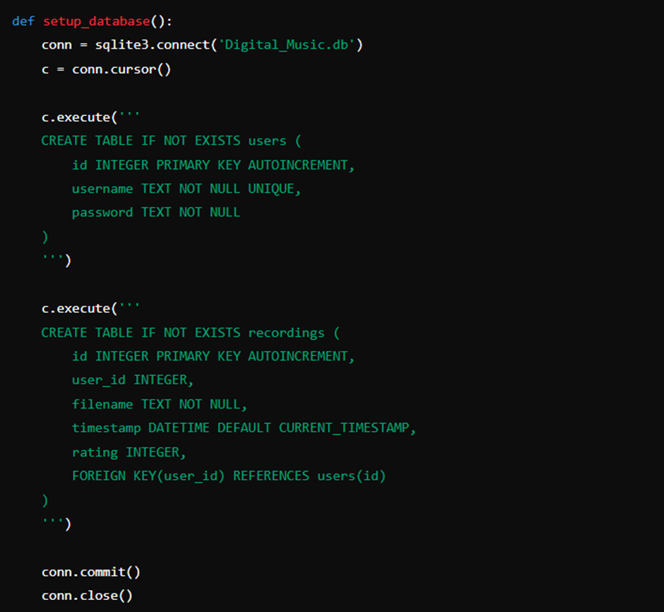

### User Registration:
Register User:
This function registers a new user by prompting for a username and password, encrypting the password, and saving the details to the database.

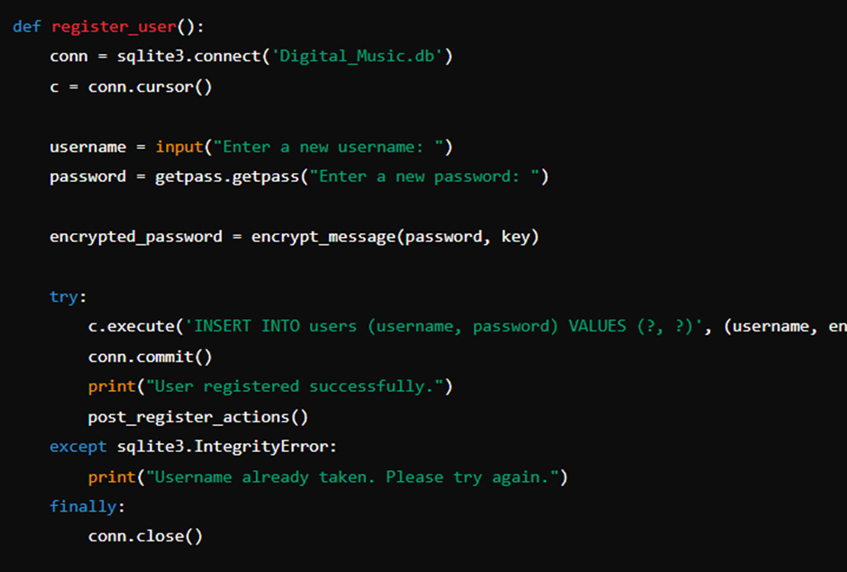

Post Register Actions:
This function handles actions immediately after user registration, such as recording audio or logging out.

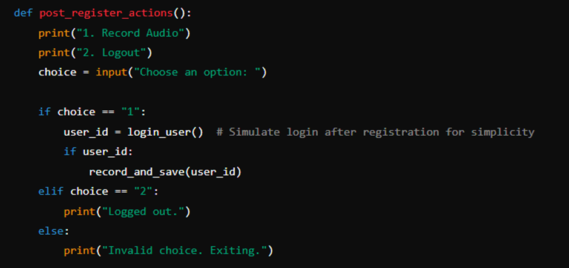

### User Login:
Login User:
This function handles user login by verifying the username and password. If the admin credentials are used, it returns 'admin'.

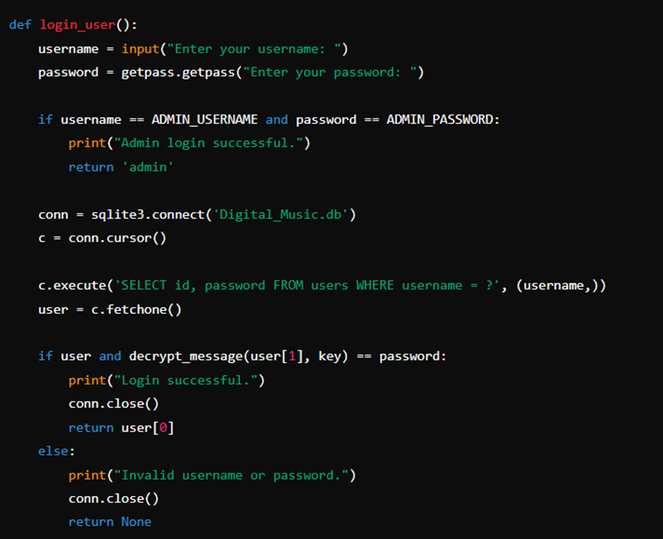

### Viewing Recordings:
View User's Recordings:
This function retrieves and displays a user's recordings from the database.

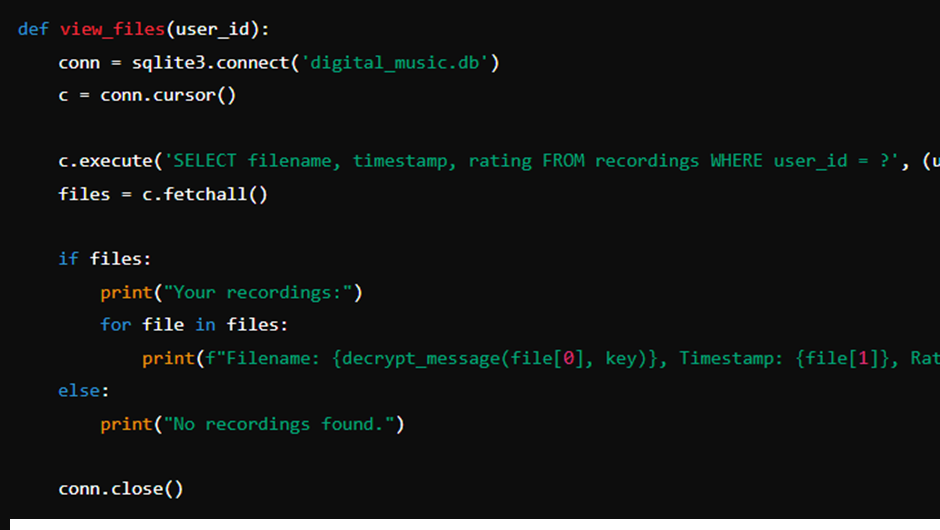

View All Recordings(Admin):
This function allows the admin to view all recordings from all users.

### Managing Recordings:
Delete Recording (Admin):
This function allows the admin to delete a recording by its ID.

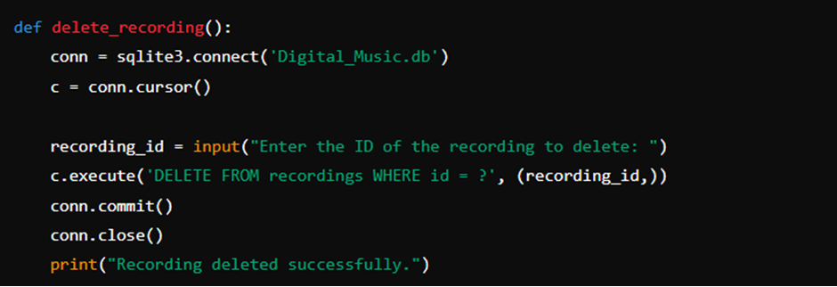

Record Audio:
This function handles audio recording and saves the recorded audio to a file.

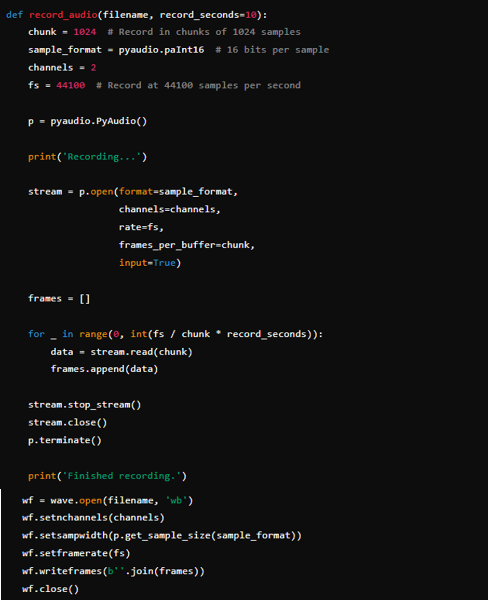

Save Recording Metadata:
This function saves recording metadata (user ID, filename, and rating) to the database.

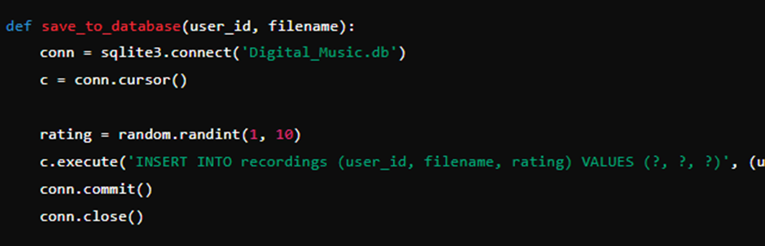

Record and Save:
This function handles the entire process of recording audio, encrypting the filename, and saving it to the database.

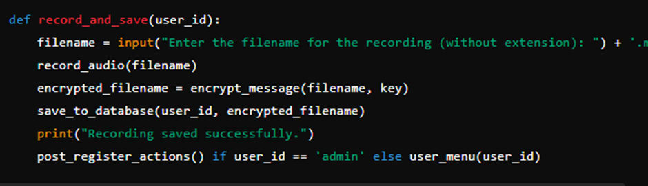

### User and Admin Menus:
User Menu:
This function displays the user menu with options to view recordings, record new audio, or log out.

### Main Function:
Main Function:
This is the main function that starts the application. It sets up the database and provides initial options to register or log in.

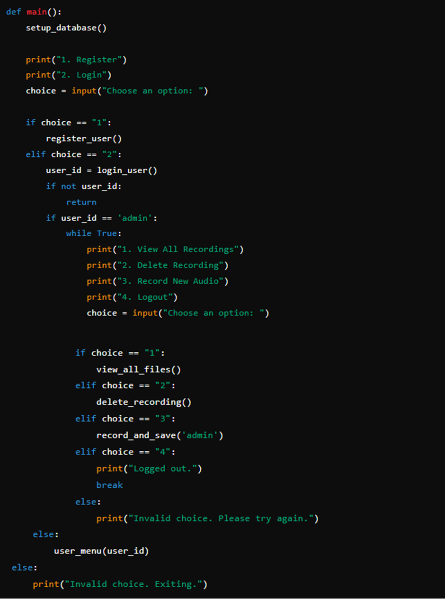

Run Main Function:
This ensures that the main() function is called when the script is run directly.

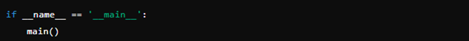

## program video demonstration 

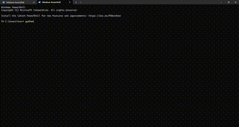

## usage

1.	Run the Program:
* Execute the script by running python Digital_Music.py from your command line or terminal.

2.	Main Menu:
* User is presented with the options 1 to register as a new user or 2 to log in if you already have an account

3.	Register a New User:
* If you choose to register, enter a new username and password when prompted
* After successful registration, you will have options to record audio or log out

4.	Login:
* If you choose to login, enter username and password to login
* If you choose to login as an admin, enter admin username and password to login

5.	User/admin Options:
*After successful login, you will have options to record audio, view recording or log out.
* If logged in as admin, you will have options to record audio, view all recordings, delete specific or log out.

6.	Recording Audio:
* When you choose to record audio, enter a filename for your song
* The program will record audio.
* The recording will be saved, encrypted, and stored in the database with song rating.

7.	Viewing Recordings:
* Regular users can view their own recordings, displaying the filename, timestamp, and rating.
* Admins can view all recordings from all users, along with associated usernames.

8.	Logout:
* Select the logout option to exit the user or admin session.

## References: 

* Blundo, C., Cimato, S., & Siniscalchi, L. (2020). Managing constraints in role based access control. IEEE Access, 8, 140497-140511.
* Shukla, S., George, J. P., Tiwari, K., & Kureethara, J. V. (2022). Data security. In Data Ethics and Challenges (pp. 41-59). Singapore: Springer Singapore.