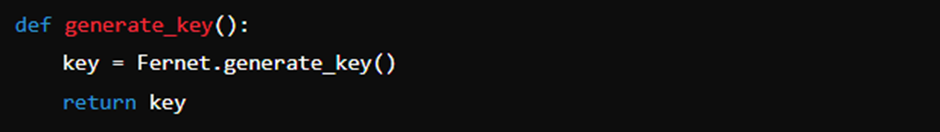
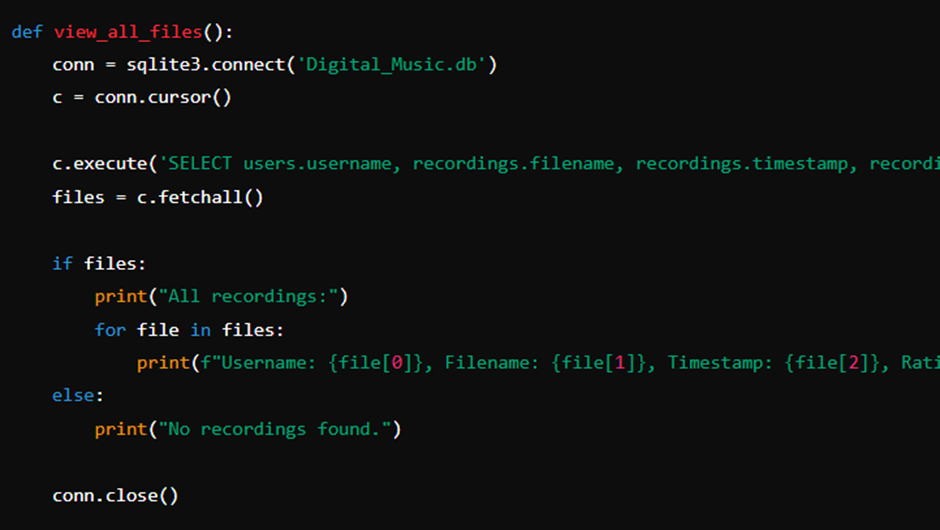
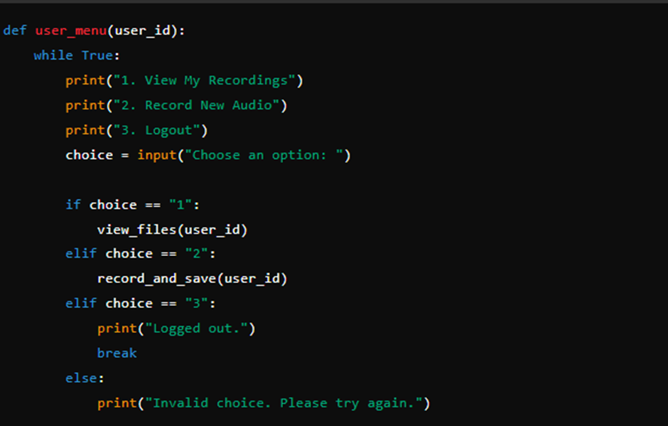

# Digital Music Recording and Storage System using Authentication and Database Encryption

## Digital Music Recording and Storage system that allows users to register, login, record, storage and rate with security techniques by authentication and encyption of data within the database.

## Introduction:

This project addresses copyright infringement concerns in the music industry, focusing on preventing unauthorised copying of user recordings. The application employs robust authentication mechanisms, role-based access control, and encryption techniques to safeguard recordings. User authentication ensures that only registered users and admins can access the system, with admins having broader management capabilities. Role-based access control restricts regular users from viewing or managing other users' recordings, while admins can oversee all recordings. Encryption of filenames and passwords provides an additional layer of security, ensuring data remains protected even if the database is compromised. These measures collectively prevent unauthorised access and copying, effectively mitigating copyright infringement risks. By securing user data and controlling access, the application ensures that recordings remain accessible only to their rightful owners and authorised personnel.

## Secure Database:

To overcome the main issues associated with relying on passwords and to ensure authentication and authorisation, the method of two-factor authentication was developed. This approach involves using two distinct components, commonly referred to as factors, namely the login credentials such as the username and password as well as a One Time Password, a dynamic code that can be obtained by the user usually via SMS (Andrews, 2018). Thus, once the user logs into the system using their username and password, they are sent a One Time Password to authenticate them and authorise them access to their account. OTP operates on the principle that every user's account is connected to a mobile phone and ideally only the user should receive SMS messages sent to the phone number associated with their account (Mulliner et al., 2013). 
Therefore, as devices are physically owned by individuals and associated with a specific account, this makes OTP an integral component of a multi-factor authentication (Reese et al., 2019). However, as studies have highlighted there several criticisms of OTP. This includes an attacker acquiring the OTP through physical access to the phone, a SIM swap attack, or wireless interception (Mulliner et al., 2013). In all these instances a cybercriminal could gain access to the OTP and authorisation into the user’s account. Thus, it is important to implement multiple layers of security measures as OTP can have limitations. 
This project uses PyOTP, a Python library for generating and authenticating one-time passwords. It is capable of implementing two-factor (2FA) or multi-factor (MFA) authentication methods in web applications and other systems that need users to log in. A time-based restriction element is also utilised to ensure the OTP times out if it is not used promptly. 

## Controlled Access:
Another Python library used in this project is the Password Validator. It is capable of validating passwords based on meting a set criteria. As described by Wang and Wang (2015), password composition policies are a set of guidelines that organisations use to help users create strong passwords. These policies outline the specifications for creating an acceptable password, including the minimum character length, for example, including at least eight characters, symbols, numbers, uppercase and lowercase letters). Password validation aims to address the issue of weak passwords and ensure users create stronger passwords. 
The purpose of strict password composition policies is to improve password security; however, they cannot guarantee that user-generated passwords will be difficult to crack. Users may still create passwords that meet the password composition policy requirements but are predictable, such as by using common words and dates or patterns (Guo et al., 2019). Therefore, to overcome these vulnerabilities, it is crucial to implement multiple layers of security measures.

## code decomposition
### Importing libraries:
These imports include necessary libraries for database management, audio recording, encryption, and general operations.

### Encryption Functions:
Generate Encryption Key:
This function generates a new encryption key using Fernet.

Save Encryption Key:
This function saves the generated key to a file.

Load Encryption Key:
This function loads the encryption key from a file.

Encrypt Message:
This function encrypts a message using the given key.

Decrypt Message:
This function decrypts an encrypted message using the given key.

### Key Management:
Check if Key Exists:
This part checks if the encryption key file exists. If not, it generates a new key and saves it; otherwise, it loads the existing key.

### Database Setup:
Setup Database:
This function sets up the SQLite database with users and recordings tables.

 

### User Registration:
Register User:
This function registers a new user by prompting for a username and password, encrypting the password, and saving the details to the database.

Post Register Actions:
This function handles actions immediately after user registration, such as recording audio or logging out.

### User Login:
Login User:
This function handles user login by verifying the username and password. If the admin credentials are used, it returns 'admin'.

### Viewing Recordings:
View User's Recordings:
This function retrieves and displays a user's recordings from the database.

View All Recordings(Admin):
This function allows the admin to view all recordings from all users.

### Managing Recordings:
Delete Recording (Admin):
This function allows the admin to delete a recording by its ID.

Record Audio:
This function handles audio recording and saves the recorded audio to a file.

Save Recording Metadata:
This function saves recording metadata (user ID, filename, and rating) to the database.

Record and Save:
This function handles the entire process of recording audio, encrypting the filename, and saving it to the database.

### User and Admin Menus:
User Menu:
This function displays the user menu with options to view recordings, record new audio, or log out.

### Main Function:
Main Function:
This is the main function that starts the application. It sets up the database and provides initial options to register or log in.

Run Main Function:
This ensures that the main() function is called when the script is run directly.

## program video demonstration 

## usage

1.	Run the Program:
* Execute the script by running python Digital_Music.py from your command line or terminal.

2.	Main Menu:
* User is presented with the options 1 to register as a new user or 2 to log in if you already have an account

3.	Register a New User:
* If you choose to register, enter a new username and password when prompted
* After successful registration, you will have options to record audio or log out

4.	Login:
* If you choose to login, enter username and password to login
* If you choose to login as an admin, enter admin username and password to login

5.	User/admin Options:
*After successful login, you will have options to record audio, view recording or log out.
* If logged in as admin, you will have options to record audio, view all recordings, delete specific or log out.

6.	Recording Audio:
* When you choose to record audio, enter a filename for your song
* The program will record audio.
* The recording will be saved, encrypted, and stored in the database with song rating.

7.	Viewing Recordings:
* Regular users can view their own recordings, displaying the filename, timestamp, and rating.
* Admins can view all recordings from all users, along with associated usernames.

8.	Logout:
* Select the logout option to exit the user or admin session.

## References: 

* Andrews, N., 2018. Can I Get Your Digits: Illegal Acquisition of Wireless Phone Numbers for Sim-Swap Attacks and Wireless Provider Liability. Nw. J. Tech. & Intell. Prop., 16, 79.
* Guo, Y., Zhang, Z. and Guo, Y., 2019. Optiwords: A new password policy for creating memorable and strong passwords. Computers & Security, 85, pp.423-435.
* Mulliner, C., Borgaonkar, R., Stewin, P. and Seifert, J.P., 2013. SMS-Based One-Time Passwords: Attacks and Defense: (Short Paper). In Detection of Intrusions and Malware, and Vulnerability Assessment: 10th International Conference, DIMVA 2013, Berlin, Germany, July 18-19, 2013. Proceedings 10 (pp. 150-159). Springer Berlin Heidelberg.
* Reese, K., Smith, T., Dutson, J., Armknecht, J., Cameron, J. and Seamons, K., 2019, July. A usability study of five two-factor authentication methods. In Proceedings of the Fifteenth Symposium on Usable Privacy and Security.
* Shostack, A., 2014. Threat modeling: Designing for security. John Wiley & Sons.
* Wang, D. and Wang, P., 2015. The emperor’s new password creation policies: An evaluation of leading web services and the effect of role in resisting against online guessing. In Computer Security--ESORICS 2015: 20th European Symposium on Research in Computer Security, Vienna, Austria, September 21-25, 2015, Proceedings, Part II 20 (pp. 456-477). Springer International Publishing.

